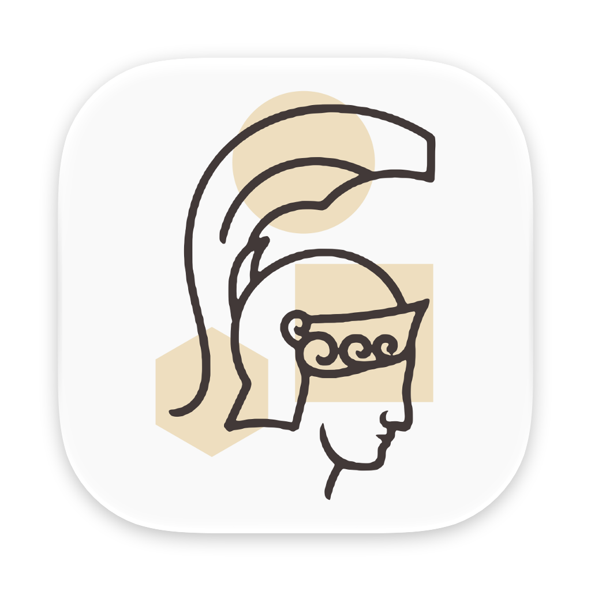

<p align="center">
  
</p>

<h1 align="center">Athina</h1>

<p align="center"><strong>A live mentor for your Mac.</strong> It watches how you work and shows you a better way when there is one.</p>

- **Help in the moment.** When you are taking the long way round, or an
  approach that will not get you where you are headed, a small note says so,
  can point at the spot on screen it means, and learns from your answer.
- **It keeps your goal in mind.** Athina carries what you appear to be
  working toward from one moment to the next, so its advice is about where you
  are going, not only what is on screen.
- **Talk back.** Hold a key and speak to answer it or ask a follow-up.
- **Private by design.** Its journal stays on your Mac, it sends what it
  needs to Claude alone, with your own API key, and it never looks inside the
  apps you exclude, password managers included from the start (see
  [Privacy model](#privacy-model)).

<picture><source media="(prefers-color-scheme: dark)" srcset="Resources/Mark/ReadmeOwl-dark.svg"></picture> **Look for the owl of Athina in your menu bar.** As the story goes, Athena's
owl sat on her shoulder and helped her see further, making things clear out of
the dark. The owl of Athina does the same for you while you work: its eyes are
open while it watches, closed when you step away, and half-lidded when you
pause it.

## The lore of the owl of Athina

Athena was the Greek goddess of wisdom, of war and of craft, and the owl was
hers from very early on: archaic images often show her with an owl perched on
her hand, and it became her emblem. Homer calls her *glaukopis*, usually
rendered "bright-eyed" or "with gleaming eyes", and the Greek word for the
little owl, *glaux*, comes from the same root, perhaps for the bird's own
striking eyes.

Why the owl became her bird is not known for certain. One explanation often
given lies in its eyes: a bird that sees in the dark, where others cannot,
made a natural sign of the goddess of wisdom, and through her the owl became a
symbol of wisdom itself. The tale that her owl sat on her shoulder, on her
blind side, and showed her the truths she could not see is later folklore
rather than ancient myth, but it says the same thing.

Athina carries the owl for that reason. It sits at the top of your screen,
quietly watching, so that when something in your work could go better, it can
help you see it.

## Overview

The **foundation** is a menu-bar app that senses what you are doing
(accessibility context plus low-cadence screen capture with on-device OCR),
records it in a local journal, and shows a debug panel with what it currently
thinks you are doing. The **mentor loop** subscribes to that stream and asks
Claude, in two tiers, whether there is a genuinely more helpful way to approach
what you are doing; when there is, a small toast says so and learns from your
answer. The **standing understanding** carries what you appear to be working
toward from one call to the next, so Athina can look out for you: it calls out
an approach that will not reach your goal, one that is slower than an
alternative you have, or one that will reach it and bring a side effect you
would not want. **Callouts and voice** let a suggestion point at the spot on
screen it is about and take a spoken reply: an answer to the toast, or a
question the mentor tier answers. Reading suggestions aloud is deferred.
Halt-and-redirect and learned suppression are later phases.

## Requirements

- macOS 26 or later (developed and measured on macOS 27, Apple Silicon)
- Xcode 26 or later with its command line tools (`swift`, `codesign`)
- No third-party dependencies: SwiftUI, ScreenCaptureKit, Vision, the
  accessibility API, Carbon hotkeys, AVFoundation and Speech for talking
  back, and the system SQLite

## Build, run, test

```sh
make build            # builds build/Athina.app from the SwiftPM binary
make mark             # rebuilds the app icon and the menu bar mark from the two SVG masters (their outputs are committed, so a plain build never needs it)
make run              # builds and launches the app, replacing only the copy this checkout's run or record launched
make run-replay       # the same, answering every model call from recorded fixtures: no network, no key, no spend (TIME_SCALE=60 runs its clock faster)
make record           # the same, live, writing every model call to a fixture file (spends API credits)
make clear-recordings # deletes the app's own recordings directory
make fixture-status   # checks that the committed fixtures are current (fails when not), with no network
make test             # runs the unit tests (swift test), the loop included, with no network
make measure          # samples the running app's CPU and memory for 60 seconds (PID=<pid> when several run)
```

None of the launch targets quits an Athina it did not start: each one stops
only the copy its own lane launched earlier from this checkout, by the pid
`scripts/launch.sh` wrote to `build/<lane>.pid`, so other checkouts, other
replays, and an Athina started any other way keep running. `make run` and
`make record` share the lane `live`; `make run-replay` uses `replay`, or
`LANE=<name>` (see Replays side by side). Because two live Athinas would share
one journal, one settings file, and one API bill, a live launch refuses to
start while another live Athina runs and names it; a build from before the
rename, running as Mentor, counts as one. Nothing stops a person
launching a second copy from Finder, which was equally true before.

There is no Xcode project. `Package.swift` defines the targets and
`scripts/bundle.sh` wraps the release binary in an app bundle with
`Resources/Info.plist` and `Resources/Athina.entitlements`, then signs it.
`swift build` and `swift test` work directly too.

`Athina --snapshot <dir>` renders every window with sample data to PNG files
(light and dark) without starting the pipeline or calling any model. It is how
UI changes get checked without a person at the screen; it needs no permissions
and never reads the keychain. Each view renders in a borderless window placed
below the desktop picture, where the window server still composites glass and
controls and ScreenCaptureKit still captures it, so nothing appears on screen
(the run puts no item in the menu bar either) and a tall Settings pane renders
whole. Replay mode has renders of its own.
`open -n build/Athina.app --args --replay <dir> --open debug` (or `settings`,
`settings:<pane>` for `general`, `contexts`, `models`, `capture`, `journal`, or
`privacy`, `permissions`, `history`) starts a replay with that window already
open, which is how a panel gets screenshotted from a shell. Keep the `--replay`:
a bare `open -n` goes round `scripts/launch.sh`, so nothing stops it starting a
second live Athina on the live journal, the live settings and the same API bill.
The live app's own windows open from its menu bar item, on the copy `make run`
already started. `--record [<dir>]` chooses where model calls go, `--time-scale
<n>` and `--advance-clock <interval>` set a replay's clock, and `--settings
<path>` chooses the settings a replay starts from; see Iterating without the
network. Where a replay keeps its own files is not an argument: it makes a
directory for itself and says which on the line it writes as it starts.

### Setup: the Anthropic API key

The mentor loop needs an Anthropic API key. Open Settings > Models (the menu's
Add API Key item goes there), paste the key, press Save, then Test Connection:
it sends one tiny request on the triage model and reports the answering model
or the API's own error message. The key
goes into your login keychain (`com.ahcarpenter.athina` /
`anthropic-api-key`) and nowhere else; the app only ever shows its last four
characters. Without a key the loop stays idle and the menu says so. Remove
deletes the keychain item. A replay needs no key, and the app never reads the
keychain while replaying.

### Code signing

The bundle script signs with `$ATHINA_SIGN_IDENTITY` if set, otherwise with the
first Apple Development or Developer ID Application identity in the keychain,
otherwise ad-hoc. macOS ties Screen Recording and Accessibility grants to the
app's designated code requirement, recorded when the grant is made. An ad-hoc
signature's default requirement is the hash of the exact binary, so a plain
ad-hoc rebuild silently invalidates both grants: System Settings still shows
the switches on, toggling them does not help, and the TCC daemon logs
"Failed to match existing code requirement". The ad-hoc path therefore signs
with an explicit requirement on the bundle identifier
(`identifier "com.ahcarpenter.athina"`), which every rebuild satisfies, so a
grant made once stays valid. The trade-off is that any ad-hoc binary claiming
that identifier would inherit the grants, which is acceptable on a development
machine and is exactly what a development certificate fixes.

The keychain is stricter than TCC: for an app that is not Apple-signed it
trusts a keychain item's readers by the hash of the exact binary, so the
first time a rebuilt ad-hoc Athina reads the API key, macOS can show its
"Athina wants to access key" prompt. The app reads the key off the main
thread and keeps sensing behind the prompt, but makes no live call until it
is answered. Always Allow adds that build to the item's list; Deny leaves the
loop without a key until the next launch. A replay never reads the key, so it
never shows the prompt. A development certificate makes this go away too.

If a grant was made against an older build (the app shows a permission as
missing although System Settings shows it on), remove the stale record and
grant again:

```sh
tccutil reset Accessibility com.ahcarpenter.athina
tccutil reset ScreenCapture com.ahcarpenter.athina
```

## Iterating without the network

Working on Athina needs no live call to Anthropic to build, test, or verify.
The app, its tests, and every verification run use **replay**: each model call
is answered from a recorded fixture, with no network, no API key, and no spend.
Replay is the default way to exercise the app, including the end-to-end checks
a change gets before it ships. Live calls are for two deliberate occasions
only: recording fixtures, including re-recording the committed set when a
change makes it stale, and the separate live check of the models' answers.

### Replay

```sh
make run-replay                                   # the committed fixtures
make run-replay REPLAY_DIR=~/Library/Application\ Support/athina/recordings
make run-replay ALLOW_STALE=1                     # also serve stale fixtures, see below
make run-replay TIME_SCALE=60                     # on a clock 60 times real time, see A faster clock
make run-replay SETTINGS=check.json LANE=a         # its own settings, in a lane of its own, see Replays side by side
open -n build/Athina.app --args --replay <dir> --open debug
```

The whole product runs as it does live. Sensing watches the real screen, the
triage and mentor gates decide as usual, and each call they allow is answered
from `<dir>` by `ReplayClaudeClient`. It matches a call on its kind (the tier:
`triage`, `mentor`, `understanding`, `followUp`, `test`, and any kind added later), never on the request
bytes, which differ on every run. The fixtures of a kind are served in file-name
order, then from the first again, so a long session keeps working and the same
sequence of calls always gets the same answers. Each answer arrives after the
recorded latency, so the in-flight states look the way they do live. Suggestions
from replayed answers become toasts, take feedback, and land in the history like
live ones. Test Connection replays the recorded test call.

**A replay runs against files of its own, seeded from your live settings.** A
replay, and a replay that was refused, keeps its journal and settings in a data
directory of its own rather than beside the live ones: a new one for each
launch, `~/Library/Application Support/athina/replay/launch-<pid>-<random>`,
which it names as it starts (see Replays side by side). Every replay launch
starts from your live settings, read and never written (or from the defaults
when there are none), unless `--settings` names another file, so the apps you
excluded stay excluded, and your retention and sensing choices hold, exactly as
you set them. Nothing a replay does, a suggestion and its feedback, a Not Now
or Never for This, a changed setting, reaches the live journal, the live
settings, another replay, or the prompts of a later live run; a setting
changed during a replay lasts until the app quits. `--record` is a real session
and uses the live files.

Nothing about a replay can be mistaken for a live call:

- the menu bar shows **Replay** beside the mark, and the menu says where the
  answers come from and that nothing is billed;
- the debug panel's status bar and Mentor card carry a Replay badge, the card
  lists the fixtures by kind with their directory, and every replayed row in
  the model call log is tagged Replay and shows "not billed";
- every replayed call is journaled in `model_calls` with `replayed = 1` and a
  cost of zero; its token counts are the recorded ones;
- replayed calls never count toward the hour's spend or the cap, and a
  replay's own journal holds no live spend, so none can hold it at the cap.

If the fixtures cannot be loaded, or the command line is contradictory (for
example `--record` with `--replay`), every call is refused with the reason,
which shows in the menu, the Mentor card, and the call log. The app never falls
back to live calls.

**Stale fixtures.** Each fixture carries the `MentorPrompts.version` it was
recorded with. A fixture whose version differs from the current one is stale:
on its turn the app refuses it with a message naming the file and both
versions, and the call is logged as an error. The tests replay the committed
set just as strictly and fail on a stale fixture, so a change that bumps the
prompt version re-records the committed set live in the same change (see The
committed fixtures). `--allow-stale-fixtures` (`make run-replay ALLOW_STALE=1`)
serves stale fixtures anyway, and is only for replaying locally while
iterating on prompts.

### A faster clock

Replay takes away the model's cost and latency, not the clock. A refresh that
comes due after fifteen minutes of use, a Not now that lasts an hour, the spend
hour, and a new day all still take that long. So every time-based behavior in
Athina reads one time source, `AthinaClock`
(`Sources/AthinaCore/System/AthinaClock.swift`): the dates the journal is
stamped with and the gates compare, the time awake a refresh counts, and every
wait (a toast's countdown, the callout check, the sensing cadence and idle
threshold, the talk-back timers, a replayed call's latency). The shipped app
runs on `SystemClock`, which is `ContinuousClock` and `Date`, so a live run is
exactly what it was. A replay runs on a clock of its own that a scripted check
can compress:

```sh
make run-replay TIME_SCALE=60
open -n build/Athina.app --args --replay <dir> --time-scale 60 --advance-clock 1d --open debug
```

- `--time-scale <n>` runs the replay's clock n times faster than real time,
  from 1 to 100. Everything above shrinks with it: at 60x the fifteen-minute
  refresh comes due after fifteen seconds of use and a toast expires after one.
  So does the idle threshold, so raise Settings > Capture > Idle after for the
  session, or keep input arriving, or sensing goes idle after a second. Timers
  paced for a person shrink too: at 60x a held talk-back key is cut off after
  half a second, so talk back to a scaled replay through the Talk back field.
  A capture still takes its real time, so at a high scale one is nearly always
  in flight. A change moment that lands during one is captured after it ends,
  but several that land during the same capture share that one next capture,
  so use a low scale when each window switch needs its own, and the advance
  directives below for long waits.
- `--advance-clock <interval>` starts the clock that far ahead: `90s`, `15m`,
  `2h`, `1d12h`, up to `30d`.
- `scripts/advance-clock.sh <pid> <interval>` moves a running replay's clock
  ahead from a script, exactly as the Advance field below does, with no
  accessibility and no window. It posts a distributed notification addressed
  to that pid (`ClockRemote`); only a replay listens, and only for its own pid,
  so a live or recording Athina and every other replay ignore it. The request
  names a file for the replay to answer at, and the script waits for that
  answer: a notification reaches only the observers registered when it is
  posted and says nothing about who heard it, so a request sent to a replay
  that is still starting, to a live Athina, or to a pid that is not Athina
  would otherwise look exactly like success and leave a check waiting on a
  clock that never moved. Nothing authenticates the channel, so a replay
  answers only at a file that does not exist yet, inside the system temporary
  directory and outside the live data folder, and refuses anything else into
  the log: otherwise a request would be a way for any process in the login
  session to create or replace a file the user can write, the live settings
  among them. It exits 0 with what the clock now reads, 1 when no
  answer arrives inside `ATHINA_CLOCK_TIMEOUT` (10 seconds by default), naming
  the pid, and 3 when the replay refused the interval.
- The debug panel's Mentor card has an **Advance** field (accessibility label
  "Advance clock"): type an interval and press Return, and the clock moves
  ahead at once, as if that much time went by with the Mac awake in the mode
  Athina is in; the seconds since the last input are the system's, so moving
  ahead never makes sensing idle by itself. Every wait due in it ends: a toast
  expires, a snooze or the spend cap releases, the next capture falls due.
  While watching it counts as active use toward the next refresh; while paused
  or idle it counts nothing; and past midnight the next observation expires the
  understanding.

Every replay makes a new directory, so its journal is empty and its clock
starts at real time, `--advance-clock` ahead of it when that is given. No
replay ever reads another's journal, so a faster clock in one never moves
another's.

The menu bar and the debug panel's Replay badges read **Replay 60x** while the
clock is scaled, and the menu's Clock line and the Mentor card's Clock field
say how fast it runs, how far it was moved ahead, and, in the card, the date it
reads. A launch that asked for a replay it could not start keeps the replay's
files, and so its clock. Either flag on a live or recording launch is
refused: the app runs on real time, and the menu, the Mentor card, and the log
say why, so a live or recording run can never use a controlled clock. A replay
given a flag value it cannot use says why in the same places, and runs on its
own clock at real time with nothing added ahead, which the Advance field and
`scripts/advance-clock.sh` still move.

The tests run on the same kind of clock with no real time at all: an
`AdjustableClock` made with a start date stands still until a test advances
it, a sleep on it ends exactly when an advance reaches its deadline, and
`waitForSleepers` lets a test advance it only once the code it drives is
waiting. No test sleeps: a refresh after fifteen minutes of use across a pause
and a closed lid, a snooze running out, the spend cap releasing at the top of
the hour, a toast's paused countdown, a callout aging out, and expiry at a new
day are each proven in milliseconds.

### Replays side by side

Any number of replays can run at once, from one checkout or several, and none
of them disturbs another or the live app:

- **Each replay has its own data directory, and only the app names it.** A
  launch makes a new one, `replay/launch-<pid>-<random>` inside the support
  directory, so its journal starts empty and its clock at real time, and it
  never collides with another replay's. Nothing outside the app chooses that
  path: there is no flag for it, so there is nothing to point at the live data
  folder, at a directory someone else can read, or at one another replay is
  already using. A launch says where it put its files on the line it writes as
  it starts, `Athina started: pid <pid> in <directory>`, and everything past
  the first ` in ` is the path, so a script reads it without quoting however
  the path is spelled. `make run-replay` prints it, the debug panel's Athina
  card shows it, and the log at launch records it. A replay holds its directory
  for as long as it runs, with a lock on `athina.pid` inside it that holds its
  pid, which is what keeps a later launch's sweep off a directory still in use.
  Every replay launch sweeps the finished per-launch directories as it starts,
  and removes those past the newest 10 and those unwritten for longer than your
  `thumbnailRetention` (6 hours by default): a finished replay's journal is
  never opened again, so retention can never age the thumbnails and recognized
  text it captured from the real screen, and the whole directory goes at that
  window instead. Newest, and unwritten, are both measured from when a
  directory's journal or its `-wal` file was last modified, so a lane that ran
  all day and quit a moment ago is one of the newest and stays readable. Read a
  finished lane's journal with `sqlite3 -readonly`, which modifies neither: a
  plain `sqlite3`, or any reader that opens it read-write, runs a checkpoint as
  it closes that modifies both, and so can keep the directory up to one window
  longer. The sweep takes the directory's lock before it removes anything, so
  it never touches one a running replay holds, and it never touches a
  directory whose name is not a launch's own.
- **`--settings <path>`** (`make run-replay SETTINGS=<path>`) starts the
  replay from that settings file instead of the live one. It is read and never
  written, so a scripted check keeps its settings in a file of its own and
  never has to swap the live settings. A file that is there but is not
  settings stops the launch, naming the file and what was wrong with it: a
  check that generated its settings and got truncated JSON would otherwise run
  on your live thresholds, contexts and retention and could report a pass on
  settings it never chose. A file that is not there at all is refused more
  gently, and the replay starts from the live settings, so the apps you
  excluded stay excluded. Put every app a replayed callout must not cover in
  that file's excluded apps.
- **`--settings` applies only to a replay.** On a live or recording launch it
  is refused, like the clock flags: the app uses the live files, and the menu,
  the Mentor card, and the log say why. The live app's files never move.
- **Launching never quits another Athina.** `make run-replay` replaces only the
  replay its lane (`LANE`, default `replay`) launched from this checkout, and
  finds that instance exactly: the launch carries a unique `--launch-token`,
  an argument the app ignores, so two launches from one checkout that overlap
  can never adopt each other's process. The token is kept beside the pid, in
  `build/<lane>.token`, and the next launch in that lane stops the pid only
  while it still carries that token: a lane stopped outside make leaves its pid
  file behind, and when the Mac has since given that pid to another lane, the
  other lane keeps running. The pid is reported only once the app itself says
  it started, on the line it writes past every reason it could refuse the
  launch and past the point where it is listening for a clock request, never
  after an elapsed time that proves nothing on a busy Mac. So a
  `scripts/advance-clock.sh` sent the moment the pid file appears is heard
  rather than posted into a channel nobody is observing yet. A launch that
  quits as it starts, a replay given a `--settings` file that is not settings
  among them, is reported as the failure it is, with what the app said, and
  leaves no pid file behind. So is a lane whose journal will not open: it can
  journal no event and answer no check, so it is reported as a failed launch
  and stopped, even though the app itself stays up when you start it by hand
  so you can read the error in the menu and the debug panel. Two lanes run
  side by side:

```sh
make run-replay LANE=a SETTINGS=/tmp/a/settings.json TIME_SCALE=60
make run-replay LANE=b SETTINGS=/tmp/b/settings.json
cat build/a.pid                                   # lane a's pid
scripts/advance-clock.sh "$(cat build/a.pid)" 2h  # moves only lane a's clock, and fails if it was not heard
```

  An on-screen check drives the app through `scripts/e2e/athina-e2e` (see
  End-to-end harness) rather than launching it itself: the harness already runs
  each check in a scratch home, excludes the owner's apps, and stops only the
  pids it started. A launch outside make uses `open -n` (a plain `open` can
  bring an already running Athina forward instead of starting one) and finds
  its instance by pid: `lsof -p <pid> | grep journal.sqlite`, or `athina.pid`
  in the data directory. Stop a replay with `kill <pid>`, never by name.

### Record

```sh
make record                          # into ~/Library/Application Support/athina/recordings
make record RECORD_DIR=recordings    # into ./recordings, which git ignores
```

`--record` runs live, with the saved key and real spend, and
`RecordingClaudeClient` writes each call to its own JSON file named
`<UTC time>-<kind>-<id>.json`. A file holds the fixture format version, the
call's kind and prompt version, the time, the model, the request exactly as it
was sent (system blocks, messages with the screenshot, output format, effort),
the response as Athina decodes it or the error, usage, latency, and the
estimated cost. The key is never written: the recorder redacts it, and anything
shaped like an Anthropic key, from the text before writing. Files are created
with mode 0600, in a directory created with mode 0700. A relative
`--record <dir>` is taken inside the app's recordings directory, never against
the working directory (which is `/` for an app started with `open`);
`make record RECORD_DIR=...` passes an absolute path. Before the first call
the app creates the directory and writes and removes a probe file there; if
that fails, every call is refused with the reason, which shows in the menu,
the Mentor card, and the call log, so a recording that could write nothing
never spends anything. Those refused calls are journaled as live errors that
cost nothing, not as replays. The menu bar shows **Recording** beside the mark
while it runs. `make clear-recordings` deletes the app's own recordings
directory, `~/Library/Application Support/athina/recordings`.

A file's name starts with the time its call started, to the millisecond, and
each call is stamped in a later millisecond than the one before, even when two
start within one millisecond or the wall clock steps back, so file-name order,
the order a replay serves each kind in, is always the order the calls were made.

Any call the loop makes through its single call path (`MentorLoop.perform`) is
recorded under its tier's raw value and replayed by that name, and neither
client knows the list of kinds. The periodic understanding refresh (tier
`understanding`, see Standing understanding) and the follow-up question about a
suggestion (tier `followUp`) are recorded and replayed that way with no change
to either client, and so is any call a later phase adds: each needs only a
fixture of its kind in the replay directory, and a replay without one refuses
that kind of call by name. A replayed refresh becomes the next revision like a
live one, and its cost, like every replayed call's, is zero.

### The committed fixtures

`Tests/AthinaCoreTests/Fixtures/Replay` is a small set recorded live from a
staged, synthetic scenario (see its README), never from anyone's real work, on
the cheapest models whose answers are worth replaying for every call kind (its
README names them). `ReplayLoopTests` runs the whole loop against it: every
triage fixture in turn, the mentor calls they lead to, the understanding each
mentor reply rewrites, the suggestion, its feedback, the journal rows, zero
spend, and the cycle starting over, and a periodic refresh answered by the
understanding fixture. `ReplayInterventionTests` replays the mentor reply's
region into a placed callout and the recorded follow-up answer. The same tests
fail when a file carries anything shaped like a key, or an em dash, and when the
set has no shown suggestion with a region or no follow-up answer.

They also fail when the set is not current: a fixture recorded with another
prompt version than `MentorPrompts.version`, or a tier with no fixture, fails
`swift test` with a message naming each stale fixture with both versions and
each tier with no fixture. The loop replay is strict, as the app's is.
`make fixture-status` runs that check on its own, with no network.

So when a prompt or schema change bumps the prompt version, or a new call kind
is added, re-record the committed set live in the same change so the tests
pass. It is a deliberate `make record` session of a few cents, on a staged
scenario and an empty journal:

1. Quit the live Athina and move the journal aside (keep it to put back).
   Triage and mentor requests carry recent journal events and screens, so a
   recording made on a lived-in journal carries that history too.
2. Stage a synthetic scenario in real windows that fill the display (the
   documents in the fixture directory's `scenario/` folder work), and add every
   other running app to Settings > Privacy > Excluded apps.
3. Run `make record RECORD_DIR=recordings`, drive it through a moment worth a
   look that yields a shown suggestion pointing at one spot, a quiet moment, a
   follow-up question typed into the debug panel's Talk back field, a Test
   Connection, and one call of every other kind, then quit. Drive it without
   keystrokes (TextEdit scripting and accessibility actions), so no other app
   takes the front and reaches a request's event history; raise the idle
   threshold for the session so sensing does not stop behind it. For the
   `understanding` kind, set Settings > Models > Refresh at most every to its
   lowest value before recording and leave the scenario in front for that whole
   interval after the last mentor call; setting Settings > Capture > Idle after
   above the interval keeps the loop watching with no input. Add Athina itself
   to the excluded apps, so opening Settings for Test Connection is never
   captured.
4. Read every file, text and screenshot, and every reply for quality (a model
   can fill a required field with an empty string), replace the fixture directory's
   recordings with the ones you keep, update its README, delete the rest, put
   the journal and settings back, and run `make fixture-status` and
   `swift test`.

`ScriptedClaudeClient` stays for unit tests that need one exact hand-written
answer, such as a refusal, an unparseable reply, or a slow call.

## End-to-end harness

Checking Athina against the real app is what takes the time, not building it:
a scratch home has to be prepared, the app launched in replay under a sandbox,
a toast waited for, a real click posted, and the journal read. Every one of
those was written again by hand for each check until now.
`scripts/e2e/athina-e2e` is that work, once, in the repository. A change, a
check, or a validation run drives the app through it rather than writing its
own driving code.

```sh
scripts/e2e/athina-e2e warm          # once per machine: prepare the warm home
scripts/e2e/athina-e2e list          # the scenarios and what each one proves
scripts/e2e/athina-e2e run all       # run them; one JSON line of result each
scripts/e2e/athina-e2e run menubar-keyboard
scripts/e2e/athina-e2e doctor        # what is missing before a run
scripts/e2e/athina-e2e journal suggestions   # a named query over the last run
```

Every run is replay only: no API key is read, no network is reachable inside
the sandbox, and nothing is billed. It needs a display, so it never runs in
CI; CI runs the harness's unit tests with the rest of the suite.

### Scenarios

| name | what it proves |
| --- | --- |
| `menubar-item-click` | a real pointer click on Athina's menu bar item opens the menu and leaves the suggestion up, and Answer Suggestion > Tell Me More is recorded |
| `menubar-empty-click` | a real click on empty menu bar space beside the item dismisses the suggestion, attributed to a real mouse-down by a session tap |
| `other-app-click` | a real click inside a staged TextEdit window dismisses the suggestion |
| `menubar-keyboard` | pressing the item through accessibility, with no pointer, keeps the suggestion up, and Not Now is recorded; the one menu bar scenario that needs no idle input |
| `menubar-width` | the item is the same width watching and in the excluded mode, so no menu bar extra beside it moves when an excluded app comes forward |
| `menubar-mark` | Athina's item keeps one width in the real menu bar as its mode changes, read through accessibility rather than from the asset; strips of the real bar and the About panel are kept as evidence of what is drawn |
| `capture-race` | counts the change moments kept and dropped while captures are in flight, on a scaled clock (see "A faster clock") |
| `understanding-surfaces` | the understanding a mentor call writes reaches the menu, the debug panel's card, and Settings > Models; the section's duration rows line up and hold a typed amount to the range the setting accepts; its footer link opens the Journal pane in place; and Reset Understanding… asks first, keeps everything on Cancel, and forgets every revision on Reset |
| `settings-pane-links` | every link from one Settings pane's text to another (Contexts to Privacy, Models to Journal) shows as a link rather than Markdown, and a real click on it changes the Settings window's pane in place rather than handing the link to the system |

A scenario prints one JSON line: its name, `pass` or `fail`, how long it took,
every check it made, and the directory holding its evidence (transcript,
screenshots, event taps, announcements, and the journal as TSV and as a copy).

### The warm fixture home

A fresh scratch home has no text-recognition model cache, so its first capture
blocks inside OCR while the model compiles, and the journal fills with events
and no observations: measured at **93 seconds** on the owner's Mac.
`athina-e2e warm` pays that once into `~/Library/Caches/athina-e2e/warm-home`
(the `com.apple.e5rt.e5bundlecache` the compile leaves behind), keeps the
caches, and throws the session's journal away. Every run then clones it with
`cp -c`, an APFS copy-on-write copy that costs no measurable time and no disk,
and starts from an empty journal in a home of its own. A run's **first capture
then lands in 1 second**. Re-warm with `warm --force` after a macOS upgrade.

### Drive helpers

`athina-drive` (`Sources/AthinaDrive`, built on demand) is the one
implementation of every step a scenario takes on the screen. It works by pid
only and never looks an app up by name.

| command | what it does |
| --- | --- |
| `permissions` | whether this shell has Accessibility and Screen Recording |
| `ready <pid>` | print `READY` once the app's menu bar extra exists |
| `windows <pid>` | the on-screen windows of a pid, with ids and frames |
| `toast <pid>` | the window id of the suggestion toast, or nothing |
| `bar [pid]` | menu bar extras and menu titles with frames, the gaps between neighbours, and a point on the bar that is on no item |
| `front` | the frontmost app and its pid |
| `activate <pid>` | bring a pid to the front |
| `ax <pid> <dump\|texts\|menuitems\|pressextra\|cancelmenu\|get\|press\|pressx\|focus\|set> [role] [match] [value]` | read or press elements through accessibility, with no pointer; `--scope` narrows the search |
| `click <item <pid> \| at <x> <y> \| window <pid> <x> <y>>` | post a real HID click, aborting if the pointer is moved or the target is not what was asked for, and log the accessibility element and topmost window under it; a window that lets clicks through, such as a window manager's full-screen overlay, does not count as covering the target; `--shot <out.png>` captures the result |
| `raise <pid> [title]` | bring one of a pid's windows to the front, which journals a window switch |
| `close <pid> <title>` | close one of a pid's windows through its close button |
| `menupick <pid> <row> <item>` | hover a submenu row and click one of its items with the pointer |
| `tap <session\|pid> [pid]` | listen-only event taps (`tap session` for every mouse-down, `tap pid <pid>` for one app), which is what attributes a dismissal to a real click rather than a timeout |
| `announce <pid>` | log every `AXAnnouncementRequested` the app posts |
| `flip <x> <y> <w> <h>` | a click-through helper window that changes text and colour on `SIGUSR1`, so sensing has something to see |
| `journal <db> <query>` | a named read-only query over a journal (`journal - queries` lists them), including `capture-race` |
| `key <keycode>` | post a key press, with `--cmd` and `--shift` as modifiers |
| `shot <window <id> \| region <x> <y> <w> <h>> <out.png>` | capture a window by id or a screen region |

The maths and parsing behind them are a plain library (`Sources/AthinaE2E`)
with unit tests: the journal queries, the menu bar geometry, the capture-race
report, and the drive tool's argument handling. The queries are run against a
journal `Journal` itself creates, so a column renamed in the app fails the
suite rather than every scenario.

### What the harness already handles, so a scenario need not

- **The warm home**, above: no run pays the cold OCR stall again.
- **Idle input.** Every pointer step waits for a quiet keyboard and mouse
  first, and a click aborts if the pointer moves off the target, because the
  Mac may have someone at it.
- **The owner's apps are excluded** in the scratch settings from the start.
  Replay serves fixtures in order whatever is on screen, so a replayed callout
  would otherwise land over the work of whoever is using the Mac.
- **The preferences leak.** `CFFIXED_USER_HOME` moves Application Support but
  not UserDefaults, so a run still writes through cfprefsd into the real
  `com.ahcarpenter.athina` domain. Every run saves that domain and restores it,
  even on failure.
- **Nothing is stopped by name.** The harness launches the binary directly and
  stops only the pids it started, never an Athina it did not launch (the make
  targets stop only their own lane, see Replays side by side).
- **A sandbox** denies the real `~/Library/Application Support/athina`, the
  `mentor` folder beside it that the app kept before the rename, and all
  outbound network, so no run can reach live data or make a live call.
- **Cleanup runs on failure**, through a trap: helpers, taps, staged apps, the
  app itself, the preferences, and the scratch home.

A validation step that needs live evidence should call this harness. Writing
the driving again is how a check ends up overrunning its time limit on a cold
home.

### Evidence and the data directory

Runs land in `~/Library/Caches/athina-e2e/runs/<scenario>-<stamp>/`, or under
`--out <dir>`; `--keep-home` keeps the scratch home to look inside it.
Each run has its own home, and `launch_athina` in `scripts/e2e/lib/harness.sh`
learns where that run's journal is rather than dictating it: the replay makes a
directory for each launch (see Replays side by side), which is what keeps two
replays apart when they share a home, and names it on the line it writes as it
starts. The harness waits for that line in `app.log`, matching its own pid so a
relaunch never reads the last one's, and takes the path from it.

## Permissions

Athina needs two permissions and explains each in a first-run window that
opens whenever one is missing. The window explains before it asks: no system
prompt appears when it opens. Each missing permission has one button. For the
sensing pair it is Open System Settings, which registers Athina in that
permission's System Settings list (macOS may show its own note pointing
there) and opens the matching pane; the window shows live status and re-checks
every second while open and when the app regains focus. Two more are optional
and serve only talking back; the window lists them below the required pair and
asks for them only when you press Request Access (Open System Settings once
the system has asked) or first hold the talk-back shortcut.

| Permission | Used for | Without it |
| --- | --- | --- |
| Screen Recording | ScreenCaptureKit capture of the display containing the focused window, then Vision OCR | Accessibility-only mode: app, window, and focused element are still sensed; no frames |
| Accessibility | Focused app, window title, focused element role and text, via the AX API; the live window frame a callout is checked against | Screen-only mode: frames and OCR only; app identity comes from NSWorkspace; no callouts, since the window cannot be verified |
| Microphone (optional) | Hearing you while the talk-back key is held | Talking back is off; a key press says so |
| Speech Recognition (optional) | Turning that audio into text on this Mac with the system recognizer, on-device only | Talking back is off; a key press says so |

Idle detection uses `CGEventSource.secondsSinceLastEventType`, which needs no
permission. Input Monitoring is never requested. The only network connection
the app ever opens is to `api.anthropic.com`, from the mentor loop, and only
when a key is saved (see Privacy model).

## Coming from Mentor

The app was called Mentor, with the bundle identifier
`com.ahcarpenter.mentor`. It is Athina now, `com.ahcarpenter.athina`, and
macOS keys both Screen Recording and Accessibility to that identifier, so the
grants made to Mentor do not carry over. The first launch of Athina therefore
senses nothing until they are granted again, once, by hand:

1. Open System Settings > Privacy & Security > Screen Recording, turn Athina
   on, and do the same under Accessibility. Athina's own first-run window has
   a button for each, and shows live status as they are granted.
2. Quit and reopen Athina, so it picks up both grants. Mentor can be removed
   from both lists at the same time; it is no longer built.

Nothing of yours is left behind or overwritten. On its first launch Athina
moves what Mentor kept, `~/Library/Application Support/mentor` (the journal
with its understanding, `settings.json`, and any recorded calls), to
`~/Library/Application Support/athina`. Quit Mentor first: Athina takes
SQLite's exclusive lock on the old journal for the whole move, and has SQLite
itself copy it rather than copying a live write-ahead-log database file by
file. The copy is assembled beside the new folder and checked there, the
journal by SQLite's integrity check and a row count of every table against the
original, every other file by SHA-256 digest, and only then put in place, with
the marker `migrated-from-mentor.json` written last. The move runs before the
app comes up, so on a large journal that first launch can sit quietly for a
while with nothing in the menu bar yet. The old folder is left exactly as it
was, yours to keep or remove. Per-launch replay directories are
not moved, since every replay makes its own, and a replay that ran under the
new name first does not stand in the way: its `replay` folder is the app's own,
not your data.

A move that cannot be finished stops that launch rather than starting an empty
journal in place of yours. Athina says what failed, in an alert, on stderr and
in the log, and quits:

- The old journal is still open in Mentor or another copy of the app, so the
  lock cannot be had. Quit it and open Athina again.
- A copy or a check failed (a full disk, a file that cannot be read).

Either way what Mentor kept is untouched, the attempt takes back whatever it
put in the new folder and nothing else, and the next launch simply tries
again. A move cut short by a crash is started again the same way. If the
same alert comes back launch after launch, the cause is not going away on its
own: move `~/Library/Application Support/mentor` somewhere else, and Athina
starts with an empty journal, leaving that copy intact where you put it.

If both folders already hold real data, the move is refused rather than
merged: Athina uses `athina`, leaves `mentor` untouched, and says so, naming
what it found, in Settings > Journal, in the debug panel, and in the log. Keep
the one you want and move the other away.

The Settings pane you had open and the window positions move with the
preferences domain on that same first live launch, laid over anything a replay
wrote there beforehand; after it, what Athina has written is never
overwritten.

The Anthropic API key moves the same careful way. On the first launch Athina
copies the keychain item saved under `com.ahcarpenter.mentor` to
`com.ahcarpenter.athina`, reads it back from there, and leaves the old item
exactly where it is; an item already under the new name is never overwritten,
and a key you delete in Settings is never copied back. So expect a third thing
on that first launch, after the two grants: the system's keychain prompt,
"Athina wants to use your confidential information stored in
com.ahcarpenter.mentor", since the login keychain trusts an item's readers by
the exact binary (see Code signing). Always Allow copies the key across; Deny
leaves it where it is, and you can paste the key into Settings > Models
instead. The copy runs off the main thread, so the app keeps sensing while the
prompt waits.

## Architecture

```
Sources/AthinaCore            library, fully testable
  Settings/                   SensingSettings (every threshold and cadence), MentorSettings (the loop's
                              section of the same file), SettingsStore (JSON), ExcludedApps, HotKey,
                              LaunchFiles (a launch's data directory and starting settings: a replay's own
                              directory, --settings, the started line that names it, and the lock that keeps it one replay's)
  Model/ActivityObservation   FocusContext, FrameInfo, TextBlock, ActivityObservation, JournalEvent,
                              SensingEvent (the stream the mentor loop consumes), SensingMode, CadenceStatus
  Scheduling/                 CaptureScheduler (pure trigger and cadence state machine),
                              FrameKeepPolicy (near-duplicate drop rule)
  Imaging/                    PerceptualHash (256-bit dHash), FrameImaging (downscale, hash, JPEG)
  Journal/                    Journal actor over the system SQLite, RetentionPolicy
  Sensing/                    AXActor (run-loop thread for the AX API), FocusTracker (NSWorkspace + AXObserver),
                              ScreenCapturer (ScreenCaptureKit), TextRecognizer (Vision),
                              SensingPipeline (orchestration), EventBroadcaster (fan-out AsyncStream)
  Claude/                     ClaudeClient (Messages API request and response types, CallIdentity, AnthropicClient
                              over URLSession), CallFixture (recorded call format and files), RecordingClaudeClient,
                              ReplayClaudeClient, ModelClientMode (live, record, or replay from the command line),
                              ScriptedClaudeClient (hand-written answers for tests), ModelCatalog and PriceTable,
                              KeyStore (Keychain and in-memory), JSONValue (schemas)
  Mentor/                     MentorScheduler (pure trigger, debounce, and gate state machine, including the
                              refresh gate), SpendMeter, SuppressionRules (snooze and never-for-this),
                              MentorshipContexts (declared contexts, normalizing, placement), ContextBuilder
                              (rolling window, prompt text, follow-up message), Prompts (versioned system
                              prompts and output schemas), Understanding (the standing record, its bounding,
                              rendering, and expiry), Suggestion, FollowUp and ModelCallRecord, Callout
                              (CalloutRegion, CalloutAnchor: frame-to-screen mapping and every rule that
                              refuses a callout), TalkBack (TranscriptMatcher, FollowUp, TalkBackState),
                              ToastCountdown (a toast's countdown, held and resumed), MenuBarMark (which variant
                              of the mark the menu bar shows), MentorLoop (orchestration)
  System/                     PermissionProbe (all four permissions), InputActivity (idle seconds),
                              ProcessResources (CPU, memory), AthinaClock (the one time source: SystemClock,
                              and AdjustableClock for tests and a replay), ClockMode (a replay's clock flags)
                              and ClockRemote (moving a replay's clock from a script)
Sources/AthinaSQLiteShim      C, one function: the `sqlite3_db_config` call Swift cannot make (it is variadic),
                              so `DataMigration` can read the old journal without altering it
Sources/Athina                the app: MenuBarExtra, AppState, windows, ToastController (floating panel),
                              Overlay/CalloutController (click-through overlay), Voice/SpeechListener
                              (on-device speech recognition), HotKeyCenter (Carbon, press and release),
                              Snapshots
Tests/AthinaCoreTests         Swift Testing suites for the pure parts, with JSON fixtures under Fixtures/
```

### Sensing loop

`SensingPipeline` is an actor with one loop. Each turn it:

1. re-reads permissions (every 2 s) and runs journal retention (every 10 min by default),
2. polls seconds-since-last-input and marks idle after `idleThreshold`,
3. computes the mode (`paused` > `waitingForPermissions` > `excluded` > `idle` > `watching` / `accessibilityOnly` / `screenOnly`),
4. asks `CaptureScheduler` whether a capture is due, and
5. sleeps until the next due time or the poll interval, or until a focus change wakes it.

Captures are triggered by app or window switches (after `focusSettleDelay`), by
input bursts settling (`inputSettleDelay`), by a slow floor cadence
(`floorInterval`) while active, or manually. Nothing runs while paused, idle,
on an excluded app, or without permissions. `minCaptureInterval` bounds the rate.
A capture consumes only the triggers noted before it started: a switch, input,
or manual request that lands while one is in flight stays pending, so the next
capture follows it under the same delays.

A capture reads the fresh accessibility context, grabs the display containing
the focused window with `SCScreenshotManager` (Athina's own windows excluded,
downscaled to `maxFrameDimension`), hashes it, and drops it if the hash is
within `hashDistanceThreshold` of the previous kept frame **and** neither the
window nor the focused text changed. Kept frames go through Vision OCR (text
blocks with bounding boxes in frame pixels and in global display points), are
JPEG-encoded, written to the journal, and published as `SensingEvent.observation`.
Because the user can switch apps while the screenshot or OCR is in flight, the
pipeline asks NSWorkspace for the live frontmost app after each of those steps
and discards the frame, without OCR or journaling, when that app is not the one
the frame was captured for or is excluded.

### Journal

`~/Library/Application Support/athina/journal.sqlite`, WAL mode, incremental
vacuum. Tables: `observations` (timestamp, app, window, accessibility summary
and JSON, OCR text and blocks, frame hash, frame geometry, reason), `thumbnails`
(JPEG blob per observation, separate so it can expire first), `events`
(start/stop, app and window switches, idle, pause, exclusion, permissions,
retention, clear). Retention deletes thumbnails older than `thumbnailRetention`,
then text and events older than `textRetention`, which settings clamp to at
least `thumbnailRetention` so text and events never expire before their
thumbnails, and then, if the file is still over `journalSizeCapBytes`, the
oldest thumbnails and finally the oldest observations and events until it fits.
"Clear Journal" in settings deletes everything.

The mentor loop adds five tables: `suggestions` (every suggestion shown, with
the user's feedback, the inferred goal it was judged against, the region it
pointed at if any, and whether a callout was drawn), `model_calls` (one row per
API call: tier, model, prompt version and size, token counts, estimated cost,
latency, outcome, the model's one-line reason, and whether it was replayed;
never the prompt text), `understanding` (one row per revision of the standing
understanding, see below), `refresh_period` (a single row: the active use
counted toward the next understanding refresh), and `follow_ups` (one row per
question talked back: the transcript, the answer or why there is none, and the
model). A moment held at the context boundary is recorded in `model_calls` as
the `outOfContext` outcome. All five expire with `textRetention`, the
understanding goes with the oldest observations and events in a size-cap sweep,
and all five are emptied by Clear Journal. A journal written by an earlier build
is migrated in place when it is opened: missing tables are created and columns
added or dropped, so nothing has to be thrown away.

Settings live next to it in `settings.json`; missing or unknown keys fall back
to defaults so older files keep working. A replay keeps both files in a data
directory of its own and starts from the live settings or the file `--settings`
names (see Replays side by side).

### Subscription point

`SensingPipeline.events()` returns an `AsyncStream<SensingEvent>`; every
subscriber sees every event from the moment it subscribes. The mentor loop
consumes `.observation(ActivityObservation)` (already journaled, with id) and
the mode events, and reads history from `Journal`. Later phases subscribe the
same way, and to `MentorLoop.events()` for suggestions and feedback.

## Mentor loop

`MentorLoop` is an actor with one consumer task over the sensing stream. For
each kept observation it runs, in order:

1. **Triage gate** (`MentorScheduler.triageGate`). The triage tier runs only on
   change moments: a kept observation whose reason is a focus change, settled
   input, or a manual capture, never a floor-cadence frame. It is debounced to
   one call per `triageMinInterval` (20 s by default) and skipped when the
   screen text is near-identical to the last triaged screen of the same window
   (line-set overlap of at least `triageSimilarityThreshold`, 0.9). Nothing
   runs while paused, idle, on an excluded app, without permissions, without an
   API key, while another call is in flight, or while the spend cap holds.
2. **Triage call** on the cheap model (`claude-haiku-4-5-20251001` by default;
   Sonnet 5, Opus 5, and Fable 5.1 are offered too) with structured output:
   `{"worth_a_look": bool, "reason": string}`, plus `context` while
   mentorship contexts are enforced.
3. **Mentor gate** (`MentorScheduler.mentorGate`), the single yes-or-no between
   triage and the strong model: the activity is inside a declared mentorship
   context (see below), triage said yes, the spend cap is not reached, and at
   least `mentorMinInterval` (2 min) has passed since the last mentor call.
4. **Mentor call** on the strong model (`claude-opus-5` at medium effort by
   default; Sonnet 5 and Fable 5.1 are offered too) with a rolling window of
   recent observations' text (bounded by `mentorWindowDuration` and
   `mentorWindowTokenBudget`), a compact event summary, the categories
   currently suppressed for the app, the standing understanding as its own
   system block, and, when `sendThumbnail` is on, the latest kept thumbnail as
   an image. While mentorship contexts are enforced the message also names the
   declared context the moment was placed in, with its description, so the
   suggestion stays useful for that work. The reply is `{"reason": string,
   "suggestion": null | {title, body, explanation, category, confidence,
   judged_goal, region}, "updated_understanding": {...}}`. A null suggestion is
   the normal outcome, and a null region is the normal suggestion; the region is
   filled only when the suggestion is about one specific spot visible in the
   attached screenshot (see Callouts). The understanding comes back on every
   call.

   Each tier has its own model and effort in Settings > Models. Effort (low,
   medium, high, extra high) goes out as `output_config.effort` only to models
   that accept it; Haiku 4.5 rejects the parameter, so its effort control is
   disabled and nothing is sent. Thinking is left at each model's default
   (adaptive on Sonnet 5, Opus 5, and Fable 5.1); no thinking configuration is
   sent.

5. **Delivery.** A suggestion under `minimumConfidence`, in a snoozed or
   never-for-this category, with an empty title or body, or in a goal category
   with no goal to judge against (see Standing understanding) is logged and
   dropped. Otherwise it is journaled and shown as a toast: a floating,
   non-activating panel under the menu bar that never takes keyboard focus and
   auto-dismisses after `toastTimeout` (60 s;
   the countdown pauses while the pointer is over it). Closing it with the x,
   or a mouse-down in any other window or on the desktop, is journaled as
   dismissed; a click on Athina's own menu bar item is not one, since it opens
   the menu that answers the toast. A timeout, or quitting the app with the
   toast still up, is journaled as expired. *Tell Me More* expands the full explanation above the
   button bar (scrolling past 300 points) and becomes *Show Less*; the three
   buttons stay pinned to the bottom edge in both states, and an expanded
   toast stays until closed. *Not Now* dismisses and snoozes that category for
   that app for `notNowSnooze` (1 h). *Never for This* records that the
   category must never be raised for that app again (the rule is listed and
   removable in Settings > General). The toast never takes keyboard focus, so
   the menu's Answer Suggestion submenu offers the same answers to the
   keyboard and VoiceOver, and VoiceOver announces a toast as it appears; while
   VoiceOver or Switch Control is on, a toast does not expire on its own. Every
   suggestion and every answer is journaled, and the history window
   (menu > Suggestions) lists them with time, app, category, feedback, and full
   text.

The system prompts and output schemas of every tier live in
`Prompts.swift` under a version number that is stored with every call and
suggestion. Each system prompt carries a `cache_control` marker, and the
request encoder sorts keys so the cached prefix is byte identical between
calls. Caching only engages above
a model's minimum cacheable prefix (512 tokens on Claude Fable 5.1 and Opus 5,
1024 on Sonnet 5, 4096 on Haiku 4.5), so in practice the mentor prompt is
served from cache within its five-minute window and the small triage prompt
is not; the marker stays so a triage model with a lower minimum benefits.
Menu > Show Last Suggestion brings a missed toast back; a toast asked for
that way never expires on its own, and a non-answer never overwrites an
answer already given. The API key is read from the Keychain inside the loop
and passed per request; it is never journaled or logged.

### Callouts

A suggestion that is about one specific spot on screen can point at it. The
mentor output schema carries an optional `region`: a bounding box in the
pixel coordinates of the frame the model saw (the message states the frame's
size) plus a note of a few words, such as "this flag". The prompt tells the
model to leave it null when no screenshot is attached, when the suggestion is
about the work as a whole, or when it is not sure where the spot is, because
a box on the wrong thing is worse than no box. The loop keeps a region only
when an image was actually sent and the box lies inside the frame; anything
else is dropped before the suggestion is journaled.

Placing the callout is `CalloutAnchor`'s job, a pure function the app feeds
live readings to. The region is mapped through the observation's `FrameInfo`
into global display points with the same scale OCR blocks use, so a region
that covers a recognized line lands exactly on that line's `screenRect`. The
callout is then drawn only when every check passes, and the first failure is
the recorded reason:

- the region is inside the frame and at least a few pixels in each dimension;
- the display the frame came from is still attached with the same bounds;
- the screen under the spot was last confirmed unchanged no more than two
  minutes ago (`CalloutAnchor.maxFrameAge`; see below for what confirms it);
- the observation recorded the window's frame, which needs Accessibility;
- the same process is frontmost and a fresh accessibility read shows the same
  window (bundle identifier and title) with its frame within two points of
  where it was captured;
- the spot's centre lies inside that window.

While a callout is up the app repeats the check once a second, and takes the
callout down the moment a check fails: the window moved, another window or app
came to the front, the display configuration changed, or the frame aged out.
A window can also change without moving: a terminal scrolls, a document is
edited. `CalloutWitness` watches for that. Every frame the sensing pipeline
keeps of the same window must still show the recognized text the region
framed within a few pixels (`CalloutAnchor.contentStillMatches`), or the
callout comes down with "content under the spot changed". Such a frame also
confirms the screen, and so does each capture the pipeline then drops as a
near duplicate of it, because it drops one only when the picture, the window,
and the focused text are all unchanged. Staleness counts from the latest
confirmation, so a callout over a screen nobody touches stays up with its
toast, through a follow-up question, while one that nothing has confirmed for
two minutes comes down. The callout also goes
away whenever the toast does, for any reason. Menu > Show Last Suggestion
re-shows the callout only when its anchor still passes.

The overlay itself is `CalloutController`: a transparent, borderless,
non-activating panel above normal windows on the display the frame came from,
with `ignoresMouseEvents` set, so it never takes focus and never intercepts a
click, key, or scroll. It draws a tinted rounded box with a soft glow around
the spot and the note beside it on the same Liquid Glass as the toast, to its
right, where the rest of a line of text is usually empty (below the box, or
above it at the bottom of the display, only when there is no room). Athina's own windows are excluded from
capture, so the overlay never appears in a frame. Settings > General > "Show
callouts on screen" (on by default) turns callouts off; the history window
records for each suggestion whether one was drawn, and the debug panel's
Mentor card shows the last callout decision with the region in frame pixels
and in screen points.

### Talking back

A push-to-talk hotkey (the talk-back shortcut), recorded in Settings > General
the same way as the pause shortcut in Settings > Privacy and unset by default,
captures the microphone only while it is held. Carbon's hotkey registration
delivers both `kEventHotKeyPressed` and `kEventHotKeyReleased` for a
combination it registered, so `HotKeyCenter` hears the key go down and up
without Input Monitoring or any other permission beyond the two optional ones.
The same combination cannot be both the pause and the talk-back key; the
recorder refuses it and validation clears it. A recording is cut off after 30
seconds in case the release is missed.

Audio goes to `SFSpeechRecognizer` for the current locale with
`requiresOnDeviceRecognition` set, so nothing is sent to Apple's servers. When
the locale has no on-device recognizer, Settings and the menu say so plainly
and the feature stays off rather than falling back to server recognition.
While the key is held the toast shows a listening indicator and the live
transcript. The toast being talked to is never hidden while voice input is
active: from the key going down until the transcript is handled or the answer
is shown, it does not expire, a click elsewhere does not dismiss it, and it is
kept in front of other windows; afterwards it stays up until it is closed,
like an expanded one, and no new suggestion replaces it until then (see
below). Each recording is its own session: a recognizer result or timeout left
over from an earlier one is ignored, so a re-press never hears the previous
question again.

When the key is released, `TranscriptMatcher` reads the whole utterance,
lowercased, without punctuation, and with filler words such as "please"
trimmed from the ends. "Tell me more", "not now", and "never for this" (and
close variants: "more", "later", "no thanks", "never again", "don't show this
again") perform that answer; "never mind", "close it", and "got it" close the
toast. Anything else becomes one follow-up question to the mentor tier: the
suggestion (title, body, explanation), the exchange so far on that suggestion,
the recognized text of the screen the suggestion was made from when the
journal still has it, and the transcript, on the mentor model and effort,
with structured output `{"answer": string}`. The answer appears in the toast's
exchange area; an empty answer is journaled as an error and the toast says
so. The call is
journaled in the model call log with the `followUp` tier and counted against
the hourly spend cap like every other call; the same gates that hold both
tiers (off, paused, idle, excluded app, no key, the cap) hold a follow-up,
which is then journaled with the reason and never sent
(`MentorScheduler.followUpGate`). A question released while another call is
in flight is not refused: the toast says it is waiting, and it is asked as
soon as that call returns. At most one question waits; pressing the key again
withdraws it and the new question takes its place, and closing the toast or
pausing withdraws it too, in neither case journaling anything. The key does
nothing with no suggestion to talk back to except a brief note in the toast
area, and with no toast up it brings the most recent suggestion back to talk
to. The history window shows the full exchange under each suggestion, and the
debug panel's Mentor card shows the last transcript and what was done with it.

A suggestion the mentor tier finishes while a talked-to toast is up never
replaces it. `MentorScheduler.publishGate` holds it, leaving the toast, the
recording, the pending answer, and the answer on screen untouched; the
exchange ends only when that toast is closed, by the user answering or
dismissing it. A press that hears nothing, or a recording cut short by
pausing, is not an exchange (`TalkBackPress`): the toast gets back whatever
countdown it had (still paused while the pointer is over it), and anything
held in the meantime is shown at once. Show Last Suggestion during a recording
on a different toast ends it the same way; on the toast already on screen it
only brings that toast to the front and does not end its own exchange. The
toast it brings back stays up until closed, as it always does. Otherwise the
held suggestion is shown normally if it is at most 30 s old (the same staleness
bound as a queued observation); otherwise, and
whenever Athina is paused while one is held, it is journaled with the feedback
"Expired, never shown" and never put on screen, since the screen it describes
is gone. Such a suggestion still appears in the history window but is skipped
by Show Last Suggestion and by a key press with no toast up, which bring back
the most recent suggestion that was actually shown.

The Mentor card also has a **Talk back** field. Words typed there and sent take
exactly the path a released key does, from transcript matching to the
follow-up call and the answer in the toast, so the whole path can be
checked, in a replay or while recording a follow-up fixture, on a Mac where
Microphone and Speech Recognition are not granted.

### Mentorship contexts

Settings > Contexts is where you say what you want
mentoring in, in your own words: a short name such as "building web apps" and
an optional sentence saying what counts. **Only mentor inside these contexts**
turns that list into a hard boundary; it is off by default, and while it is off
the contexts change nothing.

While it is on, the declared names and descriptions are appended to the triage
system prompt and triage answers `context` (one of the declared names, or null)
alongside its usual verdict, so placing the moment costs no extra call. Null is
the one way the model declines to place a snapshot, and the prompt tells it to
answer null whenever it is unsure rather than guessing. A moment triage leaves
at null never reaches the mentor tier and never becomes a suggestion; the
triage call is logged with the `outOfContext` outcome and the reason. The
standing understanding (below) stands behind the same boundary: a moment
outside every context neither reaches the mentor tier that rewrites it nor
buys a refresh of its own. The schema offers only the declared names, so the
model cannot answer with a context that does not exist. The declared list is part of the triage system
prompt's single cached block, so an edit changes that prefix once; whether the
triage prompt is served from cache at all is the per-model question answered
above.

Up to `ContextRules.maxContexts` (12) contexts may be declared, each with a
unique name of at most 60 characters and a description of at most 280. The pane
disables Add Context at the cap, refuses a name another context already uses,
and caps both fields as they are typed with a note at the limit, so nothing
saved is dropped or cut on the way in. With the switch on and no context
declared, nothing is inside anything: no triage call is made at all, and the
Contexts pane, the menu, and the debug panel all say so.

To keep an app from being looked at at all, exclude it in Settings > Privacy >
Excluded apps: while an excluded app is frontmost nothing is captured, so
nothing about it can reach any tier.

The menu bar menu shows the current verdict (`Context: inside "writing Swift"`,
or why it is out) while it is still about the frontmost app, and
`Context: not yet judged in <app>` otherwise; the debug panel's Mentor card
shows it with the app it was made for and its age, and the model call log marks
a held call with the `outOfContext` outcome.

### Standing understanding

A mentor call used to see only the last ten minutes, so it could tell you a
faster way to do the thing on screen but never whether that thing would get
you where you were going. Athina now keeps a short record of the longer arc
and carries it from one call to the next.

**What it contains.** The model writes it, in four parts: the **goals** the
user appears to be working toward, most likely first, each with the evidence
for it and a confidence; a condensed **timeline** of what has happened; the
**mentor history**, what Athina has already said and how the user answered, so
it never repeats itself or re-raises something dismissed; and **open
concerns** worth watching but not worth an interruption. `Understanding.swift`
holds the type and the pure functions for bounding, rendering, and expiry.

**How it is refreshed.** Every mentor call returns `updated_understanding`
alongside its verdict, so the record is rewritten on the way past and that
refresh costs nothing beyond the call that was made anyway; its screen window
takes every observation journaled after the ones the record's last write read,
so the rewrite folds in everything since. Each revision stores the highest
observation id its call read as that cursor rather than a time, because a
screen is stamped when its capture starts and journaled only after OCR, so one
captured before a call read the journal can land in it after. A **periodic
refresh** (`understandingRefreshInterval`, 15 minutes by default) runs only
when a whole interval of active use has passed with no mentor call to carry
it. Active use is time spent capturing the screen: a break, a pause, a
sleeping Mac, an excluded app, missing permissions, or a closed app counts for
nothing, so coming back never buys a call over the few screens since. The count is kept
in the journal, so a relaunch carries on from it. It is a third tier with its own model and effort picker (`claude-opus-5`
at low effort by default; Haiku 4.5, Sonnet 5, and Fable 5.1 are offered too), its own versioned prompt and
schema, and no screenshot: summarising does not need one. `refreshGate` in
`MentorScheduler` is the single decision, and it holds while the loop is off,
paused, idle, on an excluded app, waiting for permissions, without a key, over
the spend cap, mid-call, not yet due, or before anything has been observed.
While mentorship contexts are enforced it also holds until triage has placed
the frontmost app inside a declared context, and for as long as the last
placement was outside every one, so activity outside the contexts never buys
a refresh; the mentor tier never runs for such a moment either, so neither
path that writes the record is reached from outside them. A refresh attempt
starts the interval over whatever came of it, so a failed call waits a whole
interval like the other tiers rather than retrying on the next observation. Refresh calls appear in the model call log and count
against the hourly spend cap like every other call.

**How it is used.** The record goes to the mentor tier as its own uncached
system block after the cached prompt: every mentor call rewrites it, so the
block changes on every call and a cache marker on it would never be read,
while the prompt before it keeps its marker. Triage receives the same record
as one compact paragraph in its user message, enough to notice an action that
conflicts with the goal without paying for the whole thing. Three suggestion
categories judge the current action against the inferred goal:
`wont_achieve_goal`, `less_efficient`, and `unwanted_side_effect`. They are
raised only when there is an understanding to judge against, they carry the
goal they were judged against (shown in the history window), and Never for
This suppresses each one per app exactly like every other category.

**Size and lifetime.** `understandingTokenBudget` (1200 tokens, settable up to
3000 so a mentor reply keeps room for its thinking and a suggestion beside the
record) bounds it: the model is told the budget and the app trims to fit on
the way in, dropping the
oldest timeline entries first, then the oldest mentor history, then concerns,
then the weakest goals, always keeping the strongest goal. It expires after
`understandingIdleGap` with no activity (4 hours) and always at a new day;
expiry and reset are journaled.
**Reset Understanding…**, in Settings > Models and in the debug panel, asks
first and then forgets every revision at once. Revisions are inserted rather
than updated, so the journal keeps the trail of how the reading developed, and
the current one survives a relaunch.

**What it costs.** The common case is free: a mentor call was going to happen
anyway and the record rides along in its reply, paying only for the extra
output tokens it writes. A periodic refresh is one call on the understanding
model, text only. Measured on 2026-09-13 writing the first record from a
15-minute window: 12,899 input and 1,161 output tokens, $0.09, 70 seconds on
Claude Opus 5 at low effort. So an hour of reading and browsing with no mentor
call in it costs about $0.38 in refreshes against the $1 default cap. Raise
the interval, or pick Claude Haiku 4.5 for this tier, to spend less; both are
in Settings > Models. Like the mentor tier, a refresh holds triage while it
runs, so a long one costs a change moment or two as well. The debug panel's
Understanding card shows the revision, when it was last written, which path
wrote it, its size against the budget, and what refresh calls have cost since
this understanding began.

### Spend control

Every response's usage fields (`input_tokens`, `output_tokens`,
`cache_creation_input_tokens`, `cache_read_input_tokens`) are priced with the
table in Settings > Models (dollars per million tokens, defaults checked
against Anthropic's pricing page on the date shown there, editable) and added
to a per-clock-hour total. As the total approaches `hourlySpendCap` ($1 by
default) both minimum intervals and the refresh interval stretch by
`1 / (1 - spent / cap)`, capped at 8x: 2x at half the cap, 4x at three
quarters. At the cap no call is made until the next clock hour. The hour's total is seeded from the journal at launch, so
relaunching does not reset it. Spend this hour shows in the menu, the debug
panel status bar, and the Mentor card. Replayed calls cost nothing and are never
counted (see Iterating without the network).

## Privacy model

- Sensing stays on this Mac: the journal, thumbnails, and settings never leave
  it. The only network peer is `api.anthropic.com`, reached only by the mentor
  loop, only when an API key is saved and the loop is enabled. No other part
  of the app has network code.
- **Audio and transcripts stay on this Mac.** The microphone is open only
  while the talk-back key is held, and only the system's on-device recognizer
  ever hears it; audio is never stored. The one exception is deliberate: a transcript you spoke while holding
  the key (or typed into the debug panel's Talk back field), when it is not
  one of the toast's answers, is sent to the mentor tier as your follow-up
  question, together with the suggestion it is about,
  the earlier questions and answers on that suggestion, and the recognized
  text of the screen the suggestion was made from. Transcripts are journaled
  locally with the answers so the history window can show the exchange.
- **What leaves the machine.** The triage tier receives text only: the
  frontmost app and window title, the accessibility summary (focused element
  role and an excerpt of its text), the OCR text of the latest kept
  observation (cut at 6000 characters), and a compact summary of recent
  journal events. The mentor tier receives the rolling window of recent
  observations' text (app, window, accessibility summary, and OCR text of
  each, reaching back to the window duration in Settings and taking every
  screen journaled since the standing record's last write read the journal,
  bounded by the token budget with the oldest left out and said so when the
  record does not already cover them) and, by
  default, the latest kept thumbnail as a JPEG image. "Send the latest
  screenshot" in Settings > Models turns the image off, in
  which case the mentor tier receives text only. While mentorship contexts
  are enforced, the mentor tier also receives the name and description of the
  declared context the moment was placed in. The understanding refresh tier
  receives the current record, every screen journaled since its last write
  read the journal (the oldest left out, and said so, when they exceed the
  window's token budget), the event summary, and the app, title, and category
  of recent suggestions with the user's answers; never an image. The triage,
  mentor, and refresh tiers also receive the standing understanding itself, which is the model's own prose about the
  work, never raw screen text. Nothing else is sent: no file names, no
  keystrokes, no earlier thumbnails, no key.
- **The understanding is model-written prose about the work**, kept in the
  journal on this Mac like everything else, readable in full in the debug
  panel, bounded by its token budget, expiring with the idle gap and at a new
  day, and removable at any time with Reset Understanding or Clear Journal.
  The menu bar menu shows its strongest goal, clipped, alongside the debug
  panel and Settings > Models, whenever Athina is on and has a key.
  Both prompts that write it, the mentor prompt and the refresh prompt, tell
  the model to leave out anything private, financial, medical, or personal,
  and anything about other people on screen.
- The API key lives in the login keychain, is passed per request, and is never
  written to the journal, the logs, or the debug panel, which show at most its
  last four characters.
- With **only mentor inside these contexts** on, the declared context names and
  descriptions are part of the triage system prompt, so they do leave the
  machine with every triage call. When triage places a moment inside one of
  them, the mentor call carries that one context's name and description so the
  suggestion stays useful for that work. A moment placed outside never reaches
  the mentor tier, so no context information is sent for it; the placement
  itself is decided here from the model's answer, not there.
- **Excluded apps** (Settings > Privacy) default to Keychain Access, Passwords,
  and common password managers. While one is frontmost Athina captures no frame,
  reads no window title or element, runs no OCR, and journals only that the app
  was excluded, so nothing from them can reach any tier.
- Secure text fields are never read, even in non-excluded apps, so their
  contents never reach any tier.
- Model calls are journaled as counts (tokens, cost, latency, outcome) with the
  model's one-line reason, or the first line of a follow-up answer, never with
  the prompt or the screen text that was sent.
- **Recordings** are the one exception, and only when the app is launched with
  `--record`: each call's whole request, screen text and screenshot included,
  and its answer are written to a file on this Mac
  (`~/Library/Application Support/athina/recordings` unless another directory is
  given, mode 0700, files 0600). The API key is never written, and any
  Anthropic key visible in the screen text is redacted, though not inside the
  screenshot. `make clear-recordings` deletes them; Clear Journal does not. A
  replay (`--replay`) sends nothing anywhere, keeps its own journal and
  settings, and starts from the live settings (or a `--settings` file it never
  writes), so excluded apps stay excluded while replaying.
- **Committed fixtures** carry only staged, synthetic screen content, recorded
  for the purpose, never the captain's or any user's real work. Every recording
  is read, text and screenshot, before it is committed.
- **Pause** from the menu or with the global hotkey (default ⌃⌥⌘P) stops all
  sensing; the menu bar owl drops a lid over its eyes. Idle closes them and two
  z's drift off it, an excluded app looks away, missing permissions is a wide
  stare, and a held mentor tier winks (see Design conventions).
- Thumbnails expire after 6 hours and text after 7 days by default; the journal
  is capped at 500 MB; all three are adjustable, and the journal can be cleared
  at any time. A replay senses the real screen too, and a finished replay's
  journal is never opened again, so nothing can age it in place: the next
  replay launch removes its whole per-launch directory instead, once that
  directory has gone unwritten for longer than the thumbnail window (see
  Replays side by side).
- **Delete `~/Library/Application Support/athina/replay` yourself if you ran a
  replay on a build before this one.** Those builds kept one shared
  `journal.sqlite` there, holding thumbnails and recognized text from your real
  screen, and nothing ages it now: no launch opens it, so retention never runs
  against it, and Athina will not remove it for you. It cannot: an older build
  from another checkout may have that file open this minute, and a file's
  timestamps cannot tell that apart from one nobody has touched since the Mac
  went to sleep, so deleting it on a guess could pull the database out from
  under a running instance. Quit every Athina on the Mac and remove the
  directory. Per-launch directories, the ones this build makes, are swept for
  you, because a launch holds a lock on its own and the sweep takes that lock
  before it removes anything.
- The journal directory is created with mode 0700. Athina makes every one of
  them itself, the live one and each replay's, so there is no path someone
  else chose for a journal to land in.

## Debug panel

Menu bar > Debug Panel. Left: frontmost app, window, the Mentor loop card
(availability, the last triage gate decision and its reason, the current
mentorship context verdict, the last triage and mentor calls with tokens,
cached tokens, estimated cost and latency, spend this hour, the cadence state
with the current slowdown, the last callout decision with its region in frame
pixels and screen points, and the last transcript with what was done with it),
the Understanding card (revision, when and how it was last written, the
inferred goals with their evidence and confidence, what has been done and
said so far, open concerns, the refresh interval, when the next refresh is
due, running, or why it is held, size against the budget, what refresh calls
have cost since it began, the last refresh call, and Reset Understanding…),
focused element (role, title, description, text), cadence settings and
counters, journal size and path. Centre: the latest kept frame with OCR boxes
overlaid and the recognized text below; selecting an observation in the
timeline shows that frame instead. Right: a live timeline of observations and
events from the journal (suggestions and feedback included), or, under Model
Calls, a scrolling log of every API call with prompt size, tokens, cost,
latency, outcome, and the model's reason. The status bar shows mode, permission
state, last and next capture with reason, seconds since input, spend this hour
against the cap (for live calls), and the app's own CPU and memory. While calls
are replayed or recorded, the status bar and the Mentor card carry a Replay or
Recording badge, the card says where calls go (for a replay, the fixtures by
kind and their directory, and any stale ones), and each replayed call in the
log is tagged Replay and not billed. In a replay the Mentor card shows what the
clock reads and has the Advance field that moves it ahead, and the badge says
how much faster the clock runs when it does (Replay 60x; see A faster clock).
A replay's card also shows its own data directory and the settings it started
from, and on any launch the card says why a `--settings` flag was refused (see
Replays side by side).

## Design conventions

Every surface follows Apple's Human Interface Guidelines for macOS, audited
against the live guidelines on 2026-09-15, so later changes keep to them
rather than re-auditing. The sections Athina leans on are Designing for macOS,
The menu bar (menu bar extras), Menus, Windows, Panels, Settings, Layout,
Typography, Color, Dark Mode, Materials (Liquid Glass), Icons, SF Symbols,
Buttons, Toggles, Pickers, Text fields, Lists and tables, Alerts, Feedback,
Writing, Onboarding, Privacy, Accessibility, Keyboards, and Motion. The choices
particular to this app:

- **The menu bar extra is the app.** Athina has no Dock icon or app menu, so
  its menu leads with dimmed status rows (a status that needs something, such
  as a missing key, is the command that fixes it), then commands, windows, and
  the app menu's About and Quit. Menu items use title case and an ellipsis only
  where more input follows, and no standard keyboard shortcut is repurposed.
  The icon is the owl as a template image, one variant per mode, with a word
  beside it only in replay or recording.
- **The mark is the artist's drawing, and every asset comes from a vector.**
  `Resources/Mark/AthinaMark.svg` is the master for the app icon: a profile in a crested
  Corinthian helmet over a flat cream circle, square and hexagon, in the
  reference bitmap's own coordinates, with the line art and the cream shapes in
  separate groups so either stands alone. Ink is `#332C2B` and cream `#F1DEB7`,
  both sampled from the drawing rather than chosen. `make mark`
  (`scripts/mark-assets.swift`) builds the app icon from it and the menu bar
  mark from the second master, the owl below; their outputs are committed, so a
  plain `make build` needs nothing else, and `MarkAssetTests` fails when either
  master or the script changes without `make mark` being run. The script is in
  that record because most of the drawing lives there rather than in the
  masters: the menu bar inset, the eye treatments, the z's and the per-size
  thickening are all constants in it.
- **The app icon is the full artwork, full bleed.** macOS 26 masks a legacy
  `.icns` to the standard app icon shape itself and adds the shadow, in Finder,
  in the Dock and in About, scaling the artwork into the 824 of 1024 body, so
  the icon draws no rounded rectangle and no shadow of its own and keeps the
  drawing clear of the corners the mask rounds away. Each size is drawn from
  the vector and weighted for itself, which is what the `.icns` format exists
  to allow: the drawing's stroke is under a pixel by 32 px and would otherwise
  grey out.
- **The menu bar mark is the owl, at one width in every mode.**
  `Resources/Mark/AthinaOwl.svg` is a second master, for the menu bar only: a
  solid owl silhouette, so it sits among the bar's other extras instead of
  reading lighter than all of them the way a line drawing does at 16 points.
  It ships as a template PDF per mode, so macOS tints it like every other extra
  and one file serves every display scale. The states are made out of the
  drawing rather than hung off it: the owl's eyes are the boldest thing in it
  at this size and they are what watching means, so they carry the modes and
  the silhouette never changes. Idle, the state that says the user has stepped
  away, also gets two z's drifting off it, drawn in the clear upper left of the
  owl's own bounding box: with the pupils gone the eyes are the whitest thing
  in the set and read wide awake rather than shut, so the z's are what actually
  say asleep. Paused, the deliberate stop, takes the half-lidded eyes. Every
  state, the z's included, is made inside the owl's own box, which is what
  keeps the item one width throughout, so the other extras never shift
  sideways when Athina's state changes. Which variant a mode gets is
  `MenuBarMark.resolve`, a pure function with the whole table under test.
- **The toast is a non-activating panel, not a notification.** It floats under
  the menu bar on Liquid Glass and never takes keyboard focus, with corners
  concentric with its small capsule buttons. Because it cannot be focused, the
  menu's Answer Suggestion submenu carries its answers, VoiceOver announces
  it, and it does not expire while VoiceOver or Switch Control is on.
- **The callout is a click-through overlay** that draws its own accent stroke,
  since nothing in the system frames a spot in another app's window; its note
  sits on the toast's glass. It only fades in, and Increase Contrast thickens
  the stroke and drops the glow.
- **Settings is the SwiftUI `Settings` scene**: a toolbar of panes, the window
  titled by its pane, the last pane remembered, each pane a fixed-size grouped
  form that scrolls. Rows use the form's own label and subtitle styling, and a
  place elsewhere in Settings is a link, not a description. A duration row given
  its setting's range offers only what that setting accepts: its unit pop-up
  lists the units the range holds a whole amount of, and an amount typed outside
  the range settles at the nearest allowed one as the edit ends, rather than
  being clamped out of sight afterwards.
- **Status is never color alone.** Inline messages are `StatusLabel` and badges
  are `StatusBadge` (`Sources/Athina/Components.swift`): the symbol or capsule
  carries the color, the words stay in a label color. Text uses system text
  styles and label colors, never fixed point sizes or tertiary text for
  anything that must be read.
- **What cannot be undone asks first.** Clear Journal… and Reset
  Understanding… open a confirmation that names what is lost; the confirming
  button is plain, since it is what the person chose, and Cancel is always
  there.
- **Permissions explain before they ask.** The window never prompts on its own,
  each permission has one button, and the purpose strings in
  `Resources/Info.plist` say the same as the window in one sentence.
- **Words.** Buttons, menu items, window titles, and column headings use title
  case; labels, section headers, and status words use sentence case. The
  interface says keyboard shortcut rather than hotkey, names panes and places
  plainly, and speaks of Athina in the third person, never "we".

## Continuous integration

`.github/workflows/ci.yml` runs `swift test`, the bundle script, and `Athina
--snapshot` on GitHub's `macos-26` runner, which ships Xcode 26 and the macOS
26 SDK this package targets, and uploads the rendered PNGs, replay-mode renders
on a scaled clock included, as the `ui-snapshots` artifact. No test waits on
real time (see A faster clock). The tests exercise the pure parts
(hashing, cadence, journal, retention and its in-place migration, settings, the
mentor scheduler and every gate, mentorship context rules and placement, spend
accounting, snooze and never-for-this rules per category, the rolling window,
the understanding's encoding, versioning, bounding and expiry, prompt assembly
with and without one, request and response coding against fixture JSON,
recording, redaction, replay matching and stale refusal, launch flags, a
replay's separate files, per-launch directories with their locks and pruning,
the replay-only `--settings` flag, the line a launch writes as it starts, the
clocks, a replay's clock flags, the clock requests a script sends and where a
replay may answer them, the toast countdown, which variant of the mark the menu
bar shows and that every variant is committed at one size, callout mapping and
every anchor rejection, a callout aging out, transcript matching, the follow-up
prompt and gate, the toast rule for voice input, the whole loop against a
scripted client, follow-ups included, and the whole loop against the committed
replay fixtures, replayed strictly, a region and a follow-up answer included,
and every time-based behavior of the loop on the test clock) and Vision OCR on a
drawn bitmap, so they need no
permissions, display, network, microphone, or API key. A committed fixture that
is stale, or a tier with no committed fixture, fails the run (see The committed
fixtures). The snapshot run covers every window and Settings pane with sample
data, their empty states (no suggestions, no frames, no contexts, contexts at
the cap), the Understanding card with a record, with none, paused, with a
refresh call in flight, and after a failed refresh, the Understanding settings
section with and without a record, the callout over the sample frame, the toast
collapsed, expanded, listening, thinking, answered, and as a note, the context
editor with a duplicate name, the transient status messages (a connection test,
a refused or recording shortcut, on-device recognition unavailable), and every
variant of the menu bar mark, at the size the bar draws it, with the word a
replay puts beside it, and enlarged.
