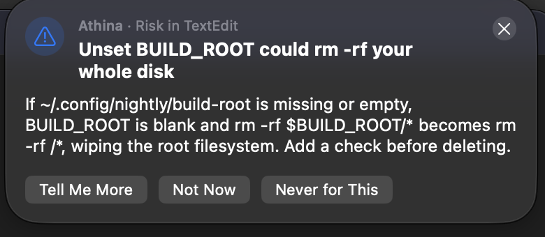
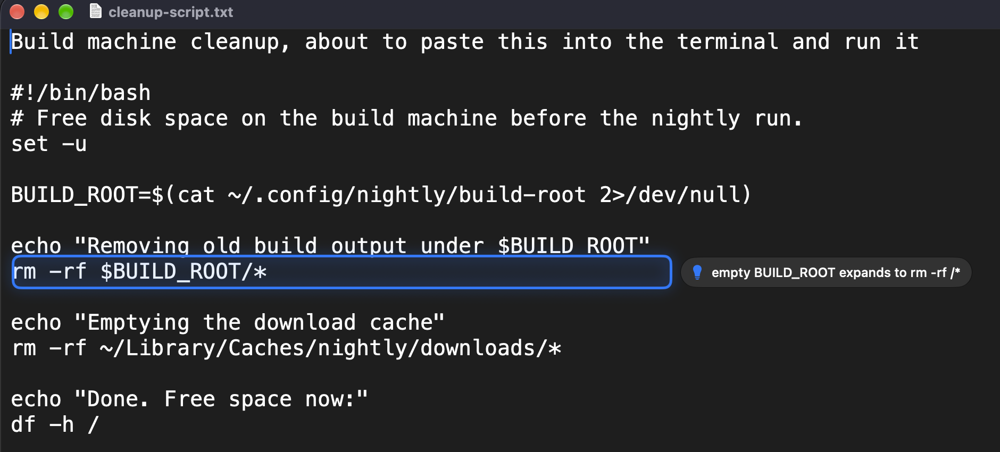

  

<h1 align="center">Athina</h1>

  

<h3 align="center"><strong>A live mentor for your Mac.</strong> It watches how you work and shows you a better way when there is one.</h3>

  
   
  

Someone is about to paste a cleanup script into the terminal: Athina notes the risk and outlines the line it means. Both pictures are one frame of the real screen, taken from a replay of the committed fixtures.

**Status:** early. Athina runs on macOS 26 or later, and feedback is wanted:
[issues](https://github.com/ahcarpenter/athina/issues) are welcome.

## Overview

Athina sits in your menu bar and notices what you are working on: the app in
front, its window, and the text on your screen, read on your Mac. When it sees
a faster way to do what you are doing, a risk you may have missed, or a step
that will not get you where you are going, it tells you in a small note under
the menu bar and can outline the spot on screen it means. It asks Claude with
your own Anthropic API key, so you pay for those calls, capped at $1 an hour
by default (see [What it costs](#setup-the-anthropic-api-key)), and nothing
else leaves your Mac.

How it works, and the words the rest of the docs use for it, is in
[the mentor loop](docs/mentor-loop.md).

## Privacy

- Nothing is captured or sent until you choose Allow in the consent window
  that opens first, and Settings > Privacy withdraws it at once.
- The journal, settings and audio stay on this Mac; the only network peer is
  `api.anthropic.com`, and only the mentor loop reaches it.
- A model call carries text read from the screen (the app, the window title,
  the focused element, the recognized text), a summary of recent events and
  the note the model keeps of what you appear to be working toward. The mentor tier
  also gets, by default, the latest screenshot thumbnail; a question you talk
  back is sent as a follow-up; and while mentorship contexts are enforced,
  their names and descriptions go too. File names, keystrokes and the key are
  never sent.
- Excluded apps (Keychain Access, Passwords and common password managers by
  default) and secure text fields are never read.
- Pause stops all sensing. Thumbnails expire after 6 hours and text after 7
  days by default, and the journal can be cleared at any time.

The [privacy model](docs/privacy.md) says exactly what each tier receives and
what is kept.

## Requirements

- macOS 26 or later (developed and measured on macOS 27, Apple Silicon)

## Install

A release is a notarized download from outside the App Store: open
`Athina-<version>.dmg` and drag Athina onto Applications, or unzip
`Athina-<version>.zip` into Applications. There are no automatic updates yet:
a new version is downloaded and dragged over the old one. A released copy
uses the same journal, settings and keychain item as a development build (see
[A released copy and your data, grants, and key](docs/releasing.md#a-released-copy-and-your-data-grants-and-key)),
and the first live launch of either moves what an earlier Mentor kept (see
[Coming from Mentor](docs/coming-from-mentor.md)). To build Athina from source
instead, see [CONTRIBUTING.md](CONTRIBUTING.md).

**Try it without a key.** From a source checkout, `make run` starts a replay:
Athina watches your real screen but answers from model calls recorded in the
repository, so it needs no API key and spends nothing. It takes Xcode 26 or
later and the two permissions below; [CONTRIBUTING.md](CONTRIBUTING.md)
has the setup.

## Setup: the Anthropic API key

The mentor loop needs an Anthropic API key. Open Settings > Models (the menu's
Add API Key item goes there), paste the key, press Save, then Test Connection:
it sends one tiny request on the triage model and reports the answering model
or the API's own error message. The key
goes into your login keychain (`com.ahcarpenter.athina` /
`anthropic-api-key`) and nowhere else; the app only ever shows its last four
characters. Without a key the loop stays idle and the menu says so. Remove
deletes the keychain item. A replay needs no key, and the app never reads the
keychain while replaying.

**What it costs.** Every call is billed to your Anthropic account at the
prices in Settings > Models. Settings > Models > Spend at most caps each clock
hour, $1 by default: calls slow down as the hour's spend nears the cap and stop
at it until the next hour begins ([spend control](docs/mentor-loop.md#spend-control)).
The menu shows the spend so far this hour against the cap. For a receipt, these are the calls behind the pictures above,
recorded live on 2026-09-15 and committed as the
[replay fixtures](Tests/AthinaCoreTests/Fixtures/Replay/README.md):

| Call | Model | Tokens in / out | Cost |
| --- | --- | --- | --- |
| Quick look at a screen, 3 calls | Claude Haiku 4.5 | 1,036 to 1,303 / 40 to 45 | $0.0013 to $0.0015 each |
| The suggestion, with a screenshot | Claude Sonnet 5, medium effort | 5,238 / 1,212 | $0.0240 |
| A question asked back about it | Claude Sonnet 5, medium effort | 1,231 / 225 | $0.0047 |
| Rewriting its notes on your goal | Claude Haiku 4.5 | 1,800 / 373 | $0.0037 |
| Test Connection | Claude Haiku 4.5 | 14 / 4 | under $0.0001 |
| **Session total** | | | **$0.0365** |

Out of the box the suggestion and the notes rewrite run on Claude Opus 5, at
2.5 times Sonnet 5's price per token. A rewrite on Opus 5 was measured at
$0.09, so an hour of reading with no suggestion in it costs about $0.38 in
rewrites (see [What it costs](docs/mentor-loop.md#standing-understanding)).
What a typical hour of everyday use costs is not measured yet; the cap bounds
it.

## Permissions

Before anything else, a first launch asks whether Athina may watch the screen
and send what it reads to Anthropic, and nothing is sensed or sent until you
choose Allow (see [Consent](docs/privacy.md#consent)). Athina then needs two
permissions and asks for neither until you press its button in the window that
opens once you have allowed it; the other two are optional and serve only
talking back ([how it asks](docs/privacy.md#permissions)).

| Permission | Used for | Without it |
| --- | --- | --- |
| Screen Recording | ScreenCaptureKit capture of the display containing the focused window, then Vision OCR | Accessibility-only mode: app, window, and focused element are still sensed; no frames |
| Accessibility | Focused app, window title, focused element role and text, via the AX API; the live window frame a callout is checked against | Screen-only mode: frames and OCR only; app identity comes from NSWorkspace; no callouts, since the window cannot be verified |
| Microphone (optional) | Hearing you while the talk-back key is held | Talking back is off; a key press says so |
| Speech Recognition (optional) | Turning that audio into text on this Mac with the system recognizer, on-device only | Talking back is off; a key press says so |

## Develop

Athina builds with SwiftPM, and the app has one third-party dependency. Plain
`make` lists every command, `make run` starts a replay that needs no key and
spends nothing, and `make check` is what a change passes before it is pushed.
[CONTRIBUTING.md](CONTRIBUTING.md) covers setup, the daily loop, the rules and
how a change reaches `main`; `docs/` holds the reference:

| Doc | Covers |
| --- | --- |
| [architecture.md](docs/architecture.md) | the source layout, the sensing loop, the journal, the subscription point |
| [mentor-loop.md](docs/mentor-loop.md) | triage and mentor calls, callouts, keyboard shortcuts, talking back, mentorship contexts, the standing understanding, spend control |
| [privacy.md](docs/privacy.md) | what leaves the Mac, what is kept, and for how long |
| [debug-panel.md](docs/debug-panel.md) | the debug panel |
| [design.md](docs/design.md) | the design conventions, the app icon and the menu bar mark |
| [code-style.md](docs/code-style.md) | the Swift style, the pinned swift-format, rebasing across the reformat |
| [testing.md](docs/testing.md) | each test layer's job, where it runs, and what the tests and snapshots cover |
| [replay.md](docs/replay.md) | replay, the faster clock, replays side by side, recording, the committed fixtures |
| [e2e.md](docs/e2e.md) | the end-to-end harness, its scenarios and tiers, the control API, hermetic runs |
| [ci.md](docs/ci.md) | the CI checks, the merge-checks label, the UI snapshot gates, checkpoints |
| [releasing.md](docs/releasing.md) | releases, code signing, the sandboxed build, the Xcode project |
| [coming-from-mentor.md](docs/coming-from-mentor.md) | what moves from Mentor on the first launch |
